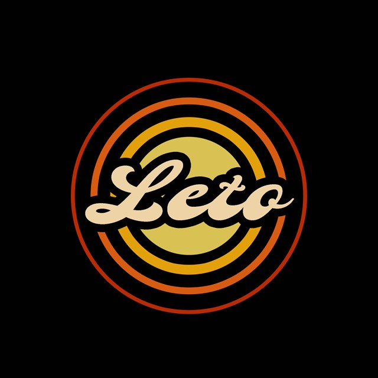

<div align="center">

# LETO Console


**Компактная хоббийная игровая консоль на STM32.**

Одна кодовая база на C++, которая стартует и на плате STM32F4, *и* на рабочем столе —
те же сцены, то же меню, те же игры.

[](https://github.com/leto-console/leto-console/actions/workflows/build.yml)
[](CMakeLists.txt)
[](CMakePresets.json)
[](leto-console.ioc)
[](LICENSE)

[Быстрый старт](#-быстрый-старт) ·
[Железо](#-железо) ·
[Сборка](#-сборка) ·
[Документация](#-документация) ·
[Участие](#-участие) ·
[Лицензия](#-лицензия)

🌐 <a href="./README.md" title="English version">English</a> • <b>Русский</b>

</div>

---

## Что это?

**LETO** — хоббийный проект в жанре «ретро-карманка + SDK». Этот репозиторий — **системный слой
консоли**: он загружает устройство, рисует интерфейс, ведает аккаунтами и сохранёнными данными,
запускает игры и открывает им системный API. Это один из трёх репозиториев — в `LetoAPI` лежат
публичные контракты, в `LetoCore` — драйверы и сервисы, `leto-console` — сам продукт.

Приём, который делает разработку возможной, — ровно та же логика компилируется дважды:

| | **Прошивка** | **Эмулятор** |
| --- | --- | --- |
| Точка входа | `Core/Src/main.cpp` | `Core/Main/App.cpp` |
| Экран | • SSD1306 128×64 монохром <br>• ST7735 160×128 цвет | • нативное окно Win32 <br>• окно Qt6 <br>• браузер по HTTP |
| Зачем | настоящая карманная консоль | разработка, CI, демо, дополнительные узлы консоли |

Сцена, собранная на ноутбуке за секунды, после прошивки платы выглядит байт в байт так же — чтобы начать вносить вклад, железо не нужно.

## ✨ Возможности

- 🎮 **Полная оболочка консоли** — заставка, аккаунты с аватарами, главное меню, игровой центр,
  файловый менеджер, системные / отладочные / EEPROM-сцены и страницы настроек.
- 🧩 **Игры как внешние модули** — приложения подгружаются во время исполнения через версионируемое
  ABI из `LetoAPI`, поэтому игра переживает обновление прошивки.
- 💾 **Постоянные типизированные настройки** — декларативные значения `StoredDataCell<T>` в
  хранилище на EEPROM, применяемые на лету.
- 📡 **Беспроводной мультиплеер** — радиомодуль nRF24L01 на 2.4 ГГц с настраиваемыми трубами (pipes)
  и каналом; два экземпляра эмулятора на одном ноутбуке уже слышат друг друга.
- 🧊 **Ни STL, ни исключений на целевой платформе** — `-fno-exceptions -fno-rtti` на ARM, контейнеры
  фиксированного размера (`StaticList`, `StaticText`, `BitmapView`) из `LetoCore`.
- 🤖 **CI собирает обе половины** — матрица GitHub Actions компилирует и прошивку, и Windows-бинарники
  и выкладывает готовые к прошивке артефакты.

<div align="center">
  <br/>
  <sub>Игры компилируются как внешние модули под ABI <code>LetoAPI</code>.</sub>
</div>

## 🔌 Железо

Плата описана в [`leto-console.ioc`](leto-console.ioc); `Core/Src/main.cpp` передаёт инициализированную
периферию в `Application::Periphery`. Из коробки консоль управляет:

| | |
| --- | --- |
| **MCU** | STM32F401CC (256 КБ flash / 64 КБ RAM) или STM32F411CE (512 КБ / 128 КБ), Cortex-M4 с hard float |
| **Дисплей** | SSD1306 128×64 монохром по I²C *или* ST7735 160×128 цвет по SPI1 — выбор за пресетом |
| **Ввод** | 7 кнопок плюс энкодер, абстракция `UserInputDevice` из `LetoCore` |
| **Память** | 32 КБ EEPROM на I²C1 (настройки, аккаунты, сохранения) и micro-SD на SPI1 через FatFs |
| **Радио** | nRF24L01 на SPI3 для игры консоль-с-консолью |
| **Обвязка** | отладочная консоль USART2 @19200, веб-мост на USART6, RTC от LSE, аппаратный CRC, TIM1, DMA, статусный LED |

## 🚀 Быстрый старт

Установи [VS Build Tools](https://visualstudio.microsoft.com/downloads/),
[Arm GNU toolchain](https://developer.arm.com/downloads/-/arm-gnu-toolchain-downloads), CMake, Ninja
и Git, затем скопируй [`clone_env.bat`](guide/deploy/clone_env.bat) и [`setup.bat`](guide/deploy/setup.bat)
в пустую папку — она станет `LETO_PATH`. Дальше из **x64 Native Tools Command Prompt**:

```bat
cd /d C:\LETO
:: клонирует LetoAPI, LetoCore и leto-console, создаёт Common\ и Apps\, прописывает LETO_PATH
clone_env.bat
:: закрой приглашение, открой новое x64 Native Tools, затем:
setup.bat
:: собирает и устанавливает все пресеты всех трёх репозиториев
"%LETO_PATH%Console\win-st7735-debug\bin\leto-console.exe"
```

Окно с интерфейсом консоли означает, что SDK в порядке. В
[руководстве по развёртыванию](guide/deploy/README_ru.md) — ручной путь сборки, `PATH` для
shared-библиотек, прошивка, Linux/Termux и устранение неполадок; есть и
[английская версия](guide/deploy/README.md).

## 🏗️ Сборка

Всё идёт через **пресеты CMake** — никаких ручных `-D`-флагов:

```sh
cmake --preset win-st7735-debug        # конфигурация
cmake --build --preset win-st7735-debug -j
```

`base`-пресет закрепляет раскладку вывода: бинарники в `bin/<preset>/`, библиотеки в `lib/<preset>/`,
деревья сборки в `build/<preset>/`.

| Семейство пресетов | Цель | Примечания |
| --- | --- | --- |
| `win-ssd1306-debug` · `win-st7735-debug` · `win-st7735-release` | эмулятор на Windows (MSVC) | `win-st7735-debug` — рабочий дефолт, все три собираются в CI |
| `stm32f401xc-ssd1306-debug` · `stm32f401xc-st7735-debug` · `stm32f411xe-st7735-debug` | прошивка STM32F4 | кросс-компиляция `gcc-arm-none-eabi`, последние два собираются в CI |
| `ubuntu-debug` | эмулятор на Linux (GCC) | единственный пресет, которому нужны Qt6 Widgets |
| `termux-debug` · `termux-win-debug` | вывод по HTTP | отдают интерфейс консоли в браузер; второй только конфигурирует — для проверки без телефона |

[`scripts/`](scripts/) оборачивает те же вызовы: `setup.bat` собирает два поставляемых пресета и ставит
их в `%LETO_PATH%Console/`, `preset_setup.bat <repo> <preset>` делает то же для одного, `build.sh`
ведёт ARM-цепочку на Linux.

### Запуск эмулятора

```bat
leto-console.exe
:: обычный запуск — это «серверный» узел: server.eeprom / server.img
leto-console.exe --client --user 0 --game
:: клиентский узел со своими образами памяти, авто-входом и авто-запуском
```

| Флаг | Действие |
| --- | --- |
| `--client` / `-c` | клиентский узел: использует `client.eeprom` / `client.img` вместо файлов `server.*` |
| `--user <n>` | автоматически аутентифицировать аккаунт *n* при загрузке (по умолчанию `0`) |
| `--game <name>` | сразу загрузить и запустить указанное приложение после входа |

### Артефакты

[`build.yml`](.github/workflows/build.yml) запускается на каждый push и pull request в `main`
(`stm32f401xc-st7735-debug`, `stm32f411xe-st7735-debug` на Ubuntu, `win-st7735-debug`,
`win-st7735-release` на Windows). Каждая задача выгружает `dist/<preset>/` в артефакт
`leto-console-<preset>` — бери готовую сборку там вместо локальной, а про прошивку на плату читай
[руководство по развёртыванию](guide/deploy/README_ru.md).

## 📚 Документация

| Документ | О чём |
| --- | --- |
| [`guide/deploy/README.md`](guide/deploy/README.md) <br> [`guide/deploy/README_ru.md`](guide/deploy/README_ru.md) | развёртывание, сборка, прошивка, устранение неполадок (EN / RU) |
| [`CONTRIBUTING.md`](CONTRIBUTING.md) | конвенции веток и коммитов, правила дома, как сборка находит `LetoAPI` / `LetoCore`, рецепты сцен и настроек |
| [`scripts/README.md`](scripts/README.md) | локальные скрипты сборки и конвенция `LETO_PATH` (RU) |
| [`LetoAPI`](https://github.com/leto-console/LetoAPI) · [`LetoCore`](https://github.com/leto-console/LetoCore) | две остальные половины SDK |

## 🗺️ Статус

До 1.0 и в движении: `main` — рабочая ветка, релизы отмечены вплоть до `v0.0.5`, обсуждения дизайна идут
в [трекере задач](https://github.com/leto-console/leto-console/issues). Текущий фокус — половина
руководства про Linux/Termux, протокол мультиплеера nRF24L01 и растущий каталог игр, собранных под ABI
`LetoAPI` v1.

## 🤝 Участие

Форкни, ответвись от `main` в ветку `NN-short-slug` (номер задачи), держи префиксы коммитов
(`feature:`, `fix:`, `docs:`) и заставь матрицу CI пройти локально до открытия pull request. В
[`CONTRIBUTING.md`](CONTRIBUTING.md) — конвенции, два пути разрешения зависимостей и рецепты для новой
сцены или постоянного параметра. Хорошие первые задачи помечены лейблами в трекере.

## 📄 Лицензия

Опубликовано под **MIT License** — см. [`LICENSE`](LICENSE). Vendored-исходники STMicroelectronics
CMSIS и HAL в `Drivers/` остаются под собственными условиями лицензии STM32 (`Drivers/*/LICENSE.txt`).

<div align="center">

Собрано сообществом LETO · *железо, которое можно подержать в руках, код, который можно прочитать.*

</div>