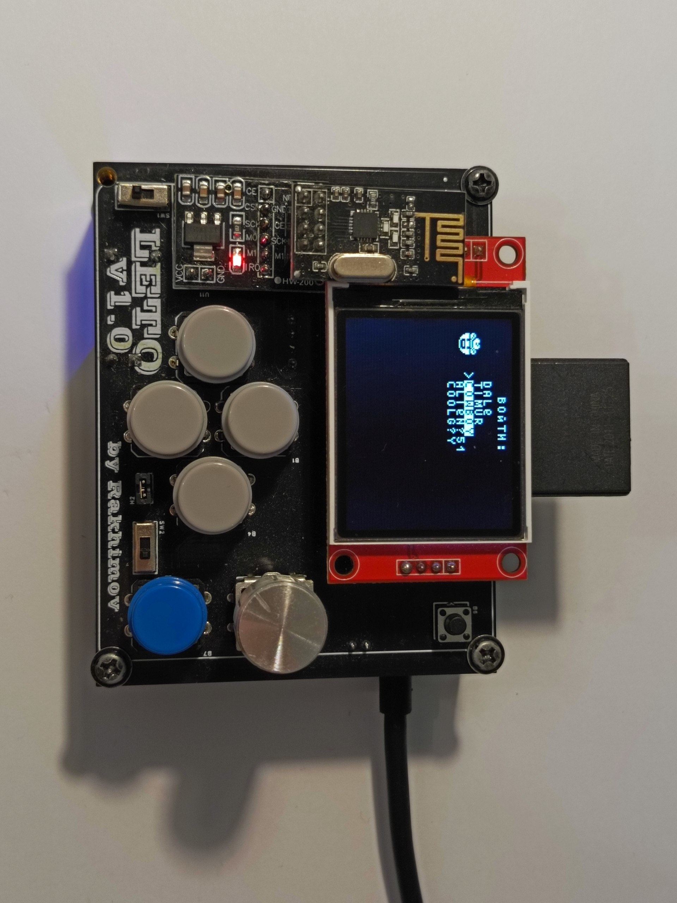
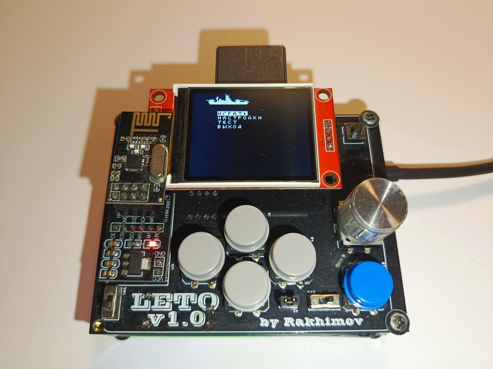
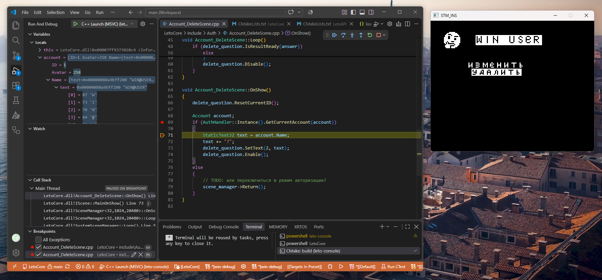
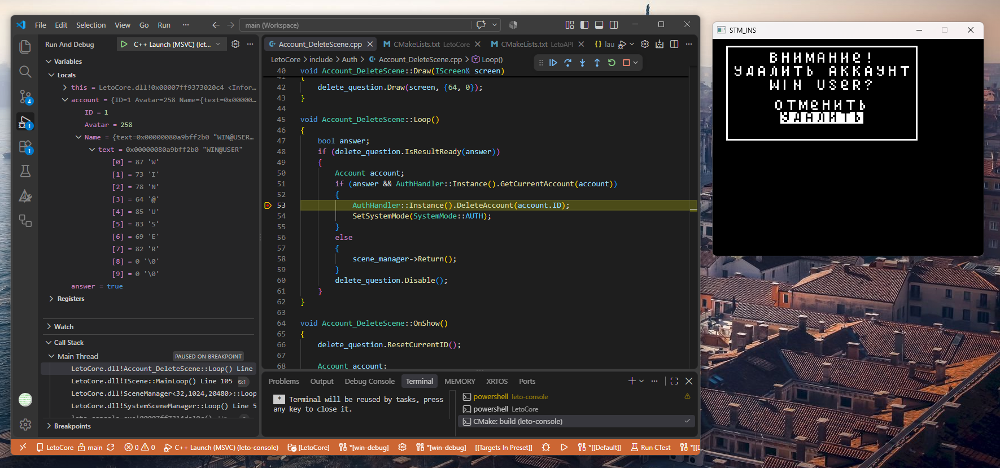
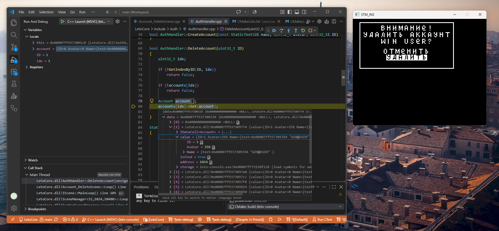

<div align="center">

# LETO Console


**Портативная игровая консоль на STM32**

[](leto-console.ioc)
[](CMakeLists.txt)
[](CMakePresets.json)
[](LICENSE)
[](https://github.com/leto-console/leto-console/actions/workflows/build.yml)

[Быстрый старт](#-1-быстрый-старт-) ·
[Железо](#2-железо) ·
[Сборка](#3-сборка) ·
[Цели](#4-цели) ·
[Документация](#5-документация) ·
[Участие](#6-участие) ·
[Лицензия](#7-лицензия)

🌐 <a href="./README.md" title="English version">English</a> • <b>Русский</b>

</div>

---

<div align="center">

## Что это?

</div>

<div align="center">
  <br/>
  <sub>Так выглядит отладочный макет консоли</sub>
</div>
<br>

**LETO** — хобби-проект портативной игровой консоли, вдохновлённый:
- *ретро-эстетикой* второй половины прошлого века (иногда и первой)
- *духом энтузиастов*, которые создавали по-настоящему гениальные вещи
- желанием *глубже понимать язык `C++`*
- экзистенциальной потребностью *прикоснуться к созданию* чего-либо

Проект следует принципам открытого и свободного ПО: его можно изучать, запускать, модифицировать, ломать, чинить и т.д.

<div align="center">

## Возможности

<div align="center">
  <br/>
  <sub>Запущенная с SD-карты игра "Морской бой"</sub>
</div>
<br>

</div>

- **Системная оболочка** — аккаунты с аватарами, главное меню, игровой центр,
  файловый менеджер, системные / отладочные сцены и страницы настроек.
- **Игры как внешние модули** — приложения подгружаются на лету через ABI и версионируемое API из `LetoAPI`.
- **Беспроводной мультиплеер** — радиомодуль с настраиваемыми каналами и
  готовая высокоуровневая маршрутизация данных.
- **CI-сборка** — GitHub Actions собирает ПО и для целевой платформы STM32, и
  для отладки под Windows, публикуя готовые к использованию артефакты.

<div align="right">

## ⚡ 1. Быстрый старт ⚡

</div>

Первую игру для LETO Console можно написать и протестировать прямо на компьютере — сама консоль для этого не нужна.

> Пока что среда разработки доступна только для Windows — вместе с эмулятором консоли. Другие платформы появятся позже.

Настройка Leto SDK и запуск проекта описаны в [руководстве по развёртыванию](guide/deploy/README_ru.md).

<div align="center">
  <br/>
  <sub>Отладка в VS Code — <i>breakpoint на открытии сцены</i></sub>
</div>
<br>

<div align="center">
  <br/>
  <sub>Отладка в VS Code — <i>breakpoint на выборе элемента меню</i></sub>
</div>
<br>

<div align="center">
  <br/>
  <sub>Отладка в VS Code — <i>Step Into в функцию из библиотеки LetoCore</i></sub>
</div>
<br>

<div align="right">

## 2. Железо

</div>

🚧 Схема платы будет добавлена позже.

Игровая консоль состоит из следующих компонентов:

| | |
| --- | --- |
| **MCU** | • `STM32F411CE` (512 КБ flash / 128 КБ RAM) <br> • `STM32F401CC` (256 КБ / 64 КБ) — урезанная версия |
| **Дисплей** | • `ST7735` 160×128 цветной по SPI <br> • `SSD1306` 128×64 монохромный по I²C |
| **Ввод** | • 4 кнопки направления  <br> • 2 кнопки действия (A и B) <br> • кнопка "Меню" <br> • энкодер |
| **Память** | • 32 КБ EEPROM по I²C (настройки, аккаунты, сохранения) <br> • micro-SD по SPI через FatFs |
| **Радио** | • `nRF24L01` по SPI |
| **Прочее** | • отладочная консоль по UART <br> • UART-канал между консолями <br> • RTC от LSE <br> • аппаратный CRC, TIM, DMA |

<div align="right">

## 3. Сборка

</div>

Эмулятор и прошивка собираются для разных конфигураций через **пресеты CMake**:

```
cmake --preset win-st7735-debug
cmake --build --preset win-st7735-debug -j
```

Для `leto-console` доступны следующие пресеты:

| Семейство пресетов | Предназначение |
| --- | --- |
| • `win-st7735-debug` <br>• `win-st7735-release` <br>• `win-ssd1306-debug` | эмулятор на Windows (MSVC) |
| • `stm32f411xe-st7735-debug` <br>• `stm32f401xc-ssd1306-debug` <br>• `stm32f401xc-st7735-debug` | прошивка STM32F4 |
| • `ubuntu-debug` | эмулятор на Linux (GCC) |
| • `termux-debug` <br>• `termux-win-debug` | эмулятор по HTTP |

### Запуск эмулятора

```bat
:: обычный запуск
leto-console.exe
:: запуск с авто-входом и авто-запуском приложения
leto-console.exe --user 0 --game %LETO_PATH%Apps\win-debug\Battleship\Battleship.dll
```

`LETO_PATH` задаётся при развёртывании SDK и уже заканчивается разделителем, поэтому обратный слэш
после неё в пути не пишется.

| Флаг | Действие |
| --- | --- |
| `--client` / `-c` | клиентский узел: использует `client.eeprom` / `client.img` вместо файлов `server.*` |
| `--user <n>` | автоматически аутентифицировать аккаунт *n* при запуске (по умолчанию `0`) |
| `--game <path>` | сразу загрузить и запустить приложение после входа; обрабатывается внутри ветки `--user`, поэтому `--user` тоже нужно указать |

<div align="right">

## 4. Цели

</div>

К версии 1.0 запланировано:

- Добавить полноценную поддержку разработки приложений на `Linux`
- Добавить API для работы со шрифтами на стороне приложения
- Настроить механизм добавления новых шрифтов в систему
- Перейти на `C++20`
- Добавить алгоритм отрисовки `Dirty rectangles`
- Добавить приятный UI системы в ретро-стиле
- Реализовать мультиязычность интерфейса с переключением языка
- Спроектировать систему питания устройства от перезаряжаемого аккумулятора
- Расширить коллекцию игр

<div align="right">

## 5. Документация

</div>

🚧 Раздел находится в разработке. Подробное описание системы будет доступно позже.

<div align="right">

## 6. Участие

</div>

Для внесения изменений необходимо:
- создать issue с описанием изменений (или взять существующее)
- ответвиться от `main` в ветку `NN-task-name` (номер задачи и её название)
- закоммитить изменения с префиксом `feature:`, `fix:`, `docs:` или иным
- открыть pull request и убедиться, что все CI-операции прошли успешно
- пройти код-ревью и после аппрува влить изменения в основную ветку

🚧 Подробные правила участия появятся позже в файле `CONTRIBUTING.md`.

<div align="right">

## 7. Лицензия

</div>

Опубликовано под **MIT License** — см. [`LICENSE`](LICENSE). Исходники STMicroelectronics CMSIS и HAL,
помещённые в `Drivers/`, распространяются по собственной лицензии STM32 (`Drivers/*/LICENSE.txt`).

<div align="center">
<br>

<i>Создано сообществом LETO</i>

</div>
